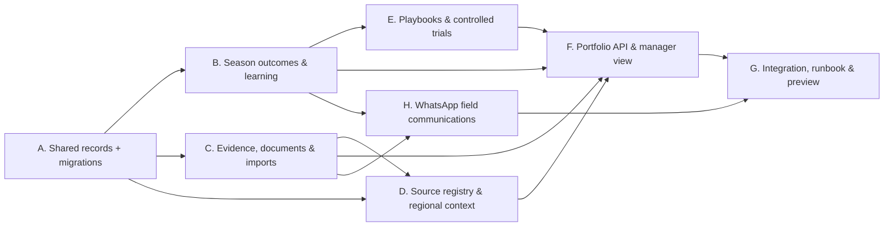

# FFL V1 Build-All Plan

## Delivery intent

Complete the safe, internal-first implementation surface of PRDs 02–07 on top of the reviewed V0 operating kernel. “Build all” means every remaining product layer has a working data model, service boundary, API, and manager-facing operating view where it can be made truthful without external credentials. It does **not** mean inventing farm facts, exposing data publicly, or silently substituting mock weather/market data for an approved provider.

## Existing foundation

V0 already provides the durable operating-unit topology; crop allocation; people; configurable signal templates; work and exceptions; immutable status audit; a seeded pilot; a typed FastAPI API; and offline field capture plus the manager action centre.

## Build contracts

- Python 3.9-compatible modular monolith. New modules never import the archived `src/`, `db/`, `dashboard/`, or `config/` product code.
- The operational record remains source- and actor-attributable. An import, document, source feed, or intelligence run never overwrites an approved primary field record.
- Data-source adapters are pull-only. They record source identity, fetch time, coverage, freshness, and failure state; missing credentials return an explicit unavailable state. The WhatsApp channel is the narrow exception: it accepts verified inbound events and sends only consented, policy-compliant, approved operational notifications.
- Real provider credentials, tenant data, raw leases, precise location, and buyer terms stay outside git and outside the Vercel preview.
- The existing SQLite implementation remains a local/pilot store. The same repository interfaces must be portable to the future Hetzner/PostgreSQL runtime.
- Vercel remains a disposable preview. Real FFL data is enabled only after the Hetzner/Postgres/bucket deployment gate.

## Dependency graph

## A. Shared records and migration-safe repository contract

**Sequential owner:** persistence/back-end.

Add tables and repositories for `evidence_artifacts`, `field_signals`, `crop_stage_checkpoints`, `harvest_records`, `season_reviews`, `source_registry`, `source_runs`, `regional_signals`, `import_batches`, `import_rows`, `playbooks`, `trials`, `trial_allocations`, `trial_confounders`, and `trial_conclusions`.

Reserve the same migration-safe contract for the PRD 07 communications records: `communication_endpoints`, `communication_consents`, `communication_templates`, `communication_events`, `communication_deliveries`, and `communication_links`. A contact endpoint and consent are scoped to an FFL operating relationship; the raw phone number and provider credentials never appear in seed data, test fixtures intended for Vercel, or preview logs.

Required invariants:

- UUID, UTC create timestamps, append-only correction/version references where a factual record may change.
- `source_registry` tracks authority level, owner, freshness target, credentials reference—not raw credentials—and schema/mapping version.
- `import_batch` stores SHA-256 content hash, a purpose, a status, raw artifact linkage, mapping version, and immutable review/publish timestamps.
- `source_run` captures cursor, coverage, fetched time, status, row counts, error summary, and next retry time.
- All new tables are created idempotently through the existing schema function and tested in memory.

## B. Season execution, soil evidence, and learning loop

**Depends on A.**

Implement a crop-stage checkpoint calendar; structured field signals bound to a published template; harvest/quality records; soil profiles and sampling evidence; and a season review that records confirmed practices, invalidated assumptions, unresolved questions, and proposed playbook changes. Harvest corrections are linked versions, never destructive updates.

API:

- `GET /api/v1/allocations/{id}/calendar`
- `POST /api/v1/allocations/{id}/signals`
- `POST /api/v1/allocations/{id}/harvest-records`
- `POST /api/v1/allocations/{id}/season-reviews`

## C. Evidence, document, and CSV import workbench

**Depends on A.**

Implement local pilot storage under a configurable evidence directory with immutable SHA-256 artifacts. Accept CSV and pasted text first; recognise PDF/DOCX/image as retained evidence and defer extraction to an approved document-class processor. Do not add an unsafe “upload anything into the DB” path.

The import workbench profiles headers, validates known purposes (`land_register`, `field_visit`, `soil_measurement`), produces row-level review records, requires explicit publish, and is idempotent on content hash. Ambiguous or invalid rows are quarantined, never guessed.

API:

- `POST /api/v1/evidence`
- `POST /api/v1/imports/csv`
- `GET /api/v1/imports/{id}`
- `POST /api/v1/imports/{id}/publish`

## D. Source registry and India context adapters

**Depends on A and C.**

Implement a source registry and health API, an IMD adapter boundary, and an AGMARKNET adapter boundary. A source receives an explicit configured endpoint and credentials reference; it may fetch only when enabled. Every result becomes a time-bounded regional context signal with an authoritative source URL/identifier. The absence of a provider token, coverage, or a fresh value is a visible unavailable/stale state—not an invented result.

API:

- `GET /api/v1/sources`
- `POST /api/v1/sources/{id}/runs`
- `GET /api/v1/regional-context?region=...`

## E. Playbooks and controlled trials

**Depends on B.**

Build governed playbooks and controlled trials. A trial carries hypothesis, protocol version, owner, treatment/comparator, eligible/participating allocations, measurements, guardrails, and confounders. Pausing/stopping a trial is a durable status event. A conclusion cannot promote a playbook until an accountable reviewer approves it; it must preserve confidence and limitations.

API:

- `POST /api/v1/playbooks`, `POST /api/v1/playbooks/{id}/approve`
- `POST /api/v1/trials`, `POST /api/v1/trials/{id}/status`
- `POST /api/v1/trials/{id}/confounders`, `POST /api/v1/trials/{id}/conclusions`

## F. Portfolio and management workspace

**Depends on B–E.**

Extend the manager surface with an internal portfolio view, allocation calendar, import/source health, trials, and season learning. All portfolio comparisons group by crop, stage, area, arrangement, and available context; no raw “farm leaderboard.” The UI will render unavailable provider data clearly and retain the V0 field experience unchanged.

API:

- `GET /api/v1/portfolio`
- `GET /api/v1/manager-context`

## G. End-to-end integration and deploy gate

**Depends on F.**

Add golden tests covering: imported CSV quarantines invalid rows; published valid soil measurement evidence; a missing IMD credential becomes an unavailable source run; a harvest correction remains traceable; a trial pause retains its evidence; the portfolio response gives contextual counts without exposing artifact contents; and the WhatsApp contract rejects an invalid signature, deduplicates a replay, suppresses an opted-out send, and never turns a delivery/read receipt into work completion. Update runbooks and create a new protected Vercel preview only after the full FFL suite passes.

## H. WhatsApp field communications

**Depends on B and C.**

Implement the provider-neutral, LoopMessage-informed operating loop from PRD 07. The first slice is deliberately small: send an approved bilingual work prompt to an opted-in field operator; receive a signed WhatsApp event; retain its evidence; create a reviewable candidate for the existing signal/exception workflow; and make delivery, failure, consent, and fallback visible to the manager. The personal-assistant repository is a learning source only: no shared user data, auth, service dependency, or copied implementation crosses into FFL.

Required invariants:

- Validate webhook authenticity before accepting an inbound event; persist the provider event ID atomically and idempotently before acknowledgement.
- Record consent, endpoint scope, template/version, sender, explicit intent, provider lifecycle, and FFL processing state. A raw interaction is not a farm fact.
- Require current consent plus a policy-valid approved template for an outbound send where the provider requires one. Use deterministic reminders only for published operational rules; human review approves free-form or material content.
- Preserve the native PWA as the primary/fallback field surface. An opt-out, no-response, failed delivery, unclear sender, or unresolvable farm context must not hide, close, or mutate the underlying work.
- Keep phone numbers, tokens, app secrets, raw media, and exact locations out of git, Vercel preview, and ordinary manager-list responses.

API boundary:

- `GET /api/v1/communications/whatsapp/webhook` for provider verification only.
- `POST /api/v1/communications/whatsapp/webhook` for signed inbound events and delivery updates.
- `POST /api/v1/communication-consents` and `POST /api/v1/communication-consents/{id}/revoke`.
- `GET /api/v1/communications/inbox` for role-scoped unresolved candidates and channel-health failures.
- `POST /api/v1/communications/{id}/accept` for a named FFL user to create/accept the canonical candidate.
- `POST /api/v1/work-items/{id}/communication-prompts` for an authorised, consented, template-backed operational prompt.

## Tactical parallelism

1. A is sequential: it freezes the new data contract, including the communications records reserved for H.
2. B and C run in separate worktrees after A; they own separate service/API/test modules, with shared schema changes landed first.
3. D and E run in separate worktrees after their dependencies are committed.
4. F integrates reviewed APIs and static modules. H follows B and C as a narrow, separately testable adapter. G is the final sequential validation/deploy gate.

## Explicitly deferred external authority

- Live IMD and AGMARKNET pulls require a FFL-owned endpoint/API key or permitted data access. The adapter and health contract will be built now; fetching remains disabled until credentials and rights are configured.
- PDF/DOCX/image extraction stores and indexes evidence now. Automated extraction and an OpenAI/Brain provider remain draft-only, source-cited, human-approved work after an access and evaluation gate.
- A production WhatsApp Business account, verified sender, approved templates, live contact consent, and a privacy/retention review are required before H sends or receives real field communications. Until then, the adapter runs only against a deterministic fake provider in tests; it never uses personal-assistant credentials or data.
- Hetzner/PostgreSQL/bucket provisioning remains the production gate documented in `docs/ffl/DEPLOYMENT.md`.
