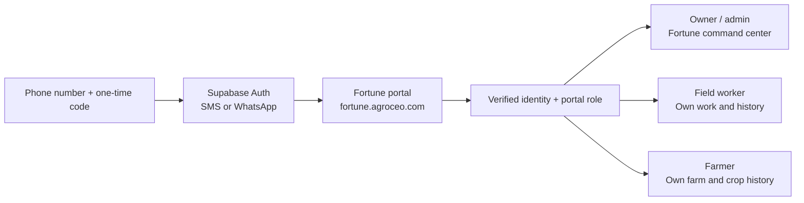

# Customer portals and phone sign-in

`fortune.agroceo.com` is a customer portal, not a farm, an operating unit, or
a TrackWick tenant. Its purpose is simple: one phone sign-in resolves the
person and sends them to the role they are actually allowed to use.



## The boundary

There are three private records, deliberately separate:

1. `agro_customer_portals` owns a hostname and display name.
2. `agro_portal_identities` binds one explicit E.164 phone to one verified
   Supabase Auth subject.
3. `agro_portal_memberships` grants that person one role in that customer:
   `owner`, `admin`, `field_worker`, or `farmer`.

The session contains only an opaque membership reference, purpose, and expiry.
Every protected request re-checks the active customer, membership, and identity
in the private database. A suspended role stops working immediately.

The existing app access table still records Fortune owner/admin authority. An
owner/admin phone activation updates that record only after the OTP succeeds.
Supabase user metadata is never used as authorization.

## What is live in the data model

The Fortune portal is provisioned with:

| Person | Portal role | Login state |
| --- | --- | --- |
| Aakash Bhalothia | Owner | Identity pending |
| Ajay Bhalothia | Owner | Identity pending |
| Daksh Bhatia | Admin | Identity pending |

No email, phone, or Auth account was invented for them. The next accountable
step is for each person to explicitly confirm their phone number and agree to
receive an OTP. The admin provisioning action will then create an `invited`
identity; the first correct OTP changes it to `active`.

## Non-negotiable privacy rule

TrackWick mobile records remain source contacts. They are not copied into
`agro_portal_identities`, used for login, or sent an authentication/WhatsApp
message. To invite a farmer or field worker later, Fortune must first:

1. review/link the source party to the right canonical person;
2. collect/confirm that person's phone and consent for portal sign-in; and
3. create their tenant membership and explicit invitation.

That preserves a useful farmer/worker portal without treating a CRM export as
permission to contact or authenticate someone.

## Sign-in flow

1. The person opens their customer hostname and enters an E.164 phone number.
2. AGRO CEO checks whether that number was explicitly invited to this portal.
   Unknown numbers receive the same generic acknowledgement, but no provider
   call occurs.
3. Only an invited phone triggers a Supabase phone OTP request.
4. Supabase verifies the code. AGRO CEO binds the returned Auth subject to the
   invited identity, opens a signed HttpOnly session, and routes by role.
5. Owner/admin opens `/manager`; farmer and field-worker profile/history
   surfaces are the next client views and will only read their own reviewed
   records.

Phone OTP is passwordless; there is no role selector and no customer-specific
password. Supabase supports SMS directly and WhatsApp through the Twilio or
Twilio Verify providers. WhatsApp is selected by
`FFL_PORTAL_OTP_CHANNEL=whatsapp` only after that provider is configured in
Supabase. Configure country rate limits, CAPTCHA, and Indian TRAI/DLT
requirements before enabling delivery.

## Required Vercel and Supabase configuration

Attach `fortune.agroceo.com` (or a Vercel wildcard for `*.agroceo.com`) to the
same Vercel project, then set these **Production-only encrypted** variables:

```text
FFL_PORTAL_BASE_DOMAIN=agroceo.com
FFL_PORTAL_SESSION_SECRET=<strong random server secret>
FFL_PORTAL_SESSION_MAX_AGE_SECONDS=43200
FFL_SUPABASE_URL=https://<project-ref>.supabase.co
FFL_SUPABASE_PUBLISHABLE_KEY=sb_publishable_<...>
FFL_PORTAL_OTP_CHANNEL=sms
```

`FFL_SUPABASE_PUBLISHABLE_KEY` may be public, but it is still stored server
side here so the backend can first enforce AGRO CEO's tenant invitation check.
Do not add a Supabase secret/service-role key to Vercel or the browser. Keep
the existing private `FFL_DATABASE_URL` as the least-privilege
`agro_vc_runtime` connection.

In Supabase Auth, enable Phone login, configure the chosen SMS/Twilio provider,
and—if using WhatsApp—choose Twilio or Twilio Verify's WhatsApp channel.
Configure rate limits and CAPTCHA before inviting users. In Vercel, configure
the exact domain/DNS and deployment environment; a checked-in project ID does
not grant an API caller authority to do any of those actions.
