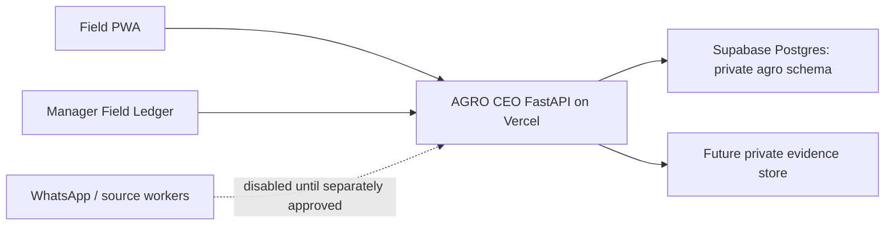

# FFL Deployment Decision

## Decision

Run the AGRO CEO pilot web/API on Vercel, backed by the private Supabase
Postgres `agro` schema. Vercel functions use the Supabase transaction pooler;
the database—not a function filesystem—is the authoritative operating record.
The prior Hetzner runtime plan is superseded for this pilot.

## Target topology

## Production configuration

Set these only in Vercel's encrypted Production environment, never in git or
browser configuration:

- `FFL_DATABASE_URL`: the Supabase **transaction-pooler** DSN for the
  least-privilege `agro_vc_runtime` role.
- `FFL_POSTGRES_SCHEMA=agro`
- `FFL_LAUNCH_PASSWORD`
- `FFL_LAUNCH_COOKIE_SECURE=true`
- `FFL_PUBLIC_ORIGIN=https://www.agroceo.co`

Do not copy Supabase service keys, a database owner/migration password,
LoopMessage credentials, model-provider keys, or other unrelated local keys to
Vercel. The runtime role can read and write the private operating tables but
cannot create schema objects. Supabase's Data API remains unexposed for
`agro`.

## Rollout order

1. Deploy and verify the Vercel production function against the private
   transaction-pooler role.
2. Create the real Fortune operating unit, people, rights, season, allocations,
   and owner records through reviewed pilot flows—never seed fictional farm
   data.
3. Add durable private evidence storage before accepting production uploads.
4. Enable one reviewed public-data adapter at a time, with provenance and
   source-run records.
5. Treat scheduled workers, WhatsApp, and named account/RBAC as later gates;
   they are not implied by this deployment.

## WhatsApp and AI gates

WhatsApp remains disabled. No personal-assistant code, user data, or
credentials cross into FFL. A future activation still requires an approved
provider account, verified webhook, approved templates, consent/opt-out,
worker recovery, alerting, and the field PWA fallback.

AGRO CEO does not currently make automatic agronomic recommendations. Any
future intelligence is an attributable, human-reviewed draft, never a
replacement for a field observation, decision, or approval.
