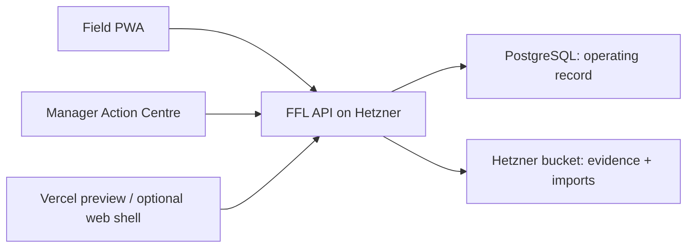

# FFL Deployment Decision

## Decision

Run the authoritative Fortune Farm Labs operating system on Hetzner. Use Vercel for preview deployments and, if useful later, for the public web shell. Do not put the source-of-truth API or SQLite database on Vercel.

The V0 application currently uses a local SQLite file. Vercel supports FastAPI functions, but function-local storage is not the durable operating record FFL needs. A field exception, a decision, or a crop-allocation history must survive deploys and retries.

## Current Vercel status

- The Vercel connector is authenticated; it can be used to deploy without placing a raw token in this repository.
- The connected teams have no existing Vercel project for this codebase. A new preview project will be created only after the reviewed field and manager surfaces are integrated.
- No Vercel token is printed, copied into `.env`, committed, or exposed in logs. Connector authentication is sufficient for deployment; a raw personal token is neither needed nor appropriate to retrieve.

## Target topology

## Rollout order

1. Finish and verify the V0 vertical slice locally.
2. Create a Vercel preview for UI and stakeholder review. It is explicitly non-authoritative and uses no real farm data.
3. Provision the Hetzner runtime with PostgreSQL, a private bucket, TLS, backups, and observability.
4. Move the repository's persistence adapter from SQLite to PostgreSQL before any real FFL record is entered.
5. Put imports, evidence uploads, and regional-source snapshots in the bucket. Keep application metadata and audit records in PostgreSQL.
6. Point a chosen FFL subdomain at the production Hetzner gateway. Vercel may remain the web-edge if the split is operationally useful.

## Secrets and environment contract

Store these only in the hosting provider's encrypted environment settings, never in git:

- `DATABASE_URL`
- `S3_ENDPOINT`
- `S3_REGION`
- `S3_BUCKET`
- `S3_ACCESS_KEY_ID`
- `S3_SECRET_ACCESS_KEY`
- `FFL_PUBLIC_BASE_URL`
- future model-provider credentials, when a reviewed intelligence adapter is enabled

The exact Hetzner endpoint, bucket name, production domain, and deployment team are intentionally not guessed. They are operator inputs, not product defaults.

## AI cost posture

V0 has no model dependency. Work, exception, approval, and audit data must be reliable before an assistant touches them. Use the available Terra coding agents for complex implementation/review work; reserve a lower-cost model tier for bounded extraction, classification, and document parsing only after the data-ingestion PRD is implemented. Any crop or operational recommendation remains a human-approved draft with source and evidence attached.
