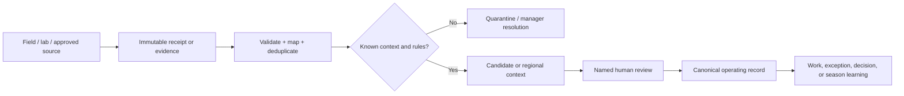

# FFL operating data flows and ETL

## One pipeline, five useful flows

FFL does not synchronise every available agriculture dataset into farm records. It runs a single governed pipeline and admits only five high-value flows.

The source is always retained next to the result: who/what supplied it, source identifier or URL, observed time, received time, mapping version, coverage, confidence/limitations, and evidence link. Nothing has silent overwrite authority.

| Flow | Ingest | Normalised output | Human outcome | Cadence |
|---|---|---|---|---|
| 1. Field execution | PWA report, WhatsApp candidate, photo, voice, manual measurement | field signal or exception candidate, linked to allocation/work | accept, correct, reject, or assign work | event-driven |
| 2. Soil and water | lab PDF/CSV, sample record, irrigation reading/log | evidence-backed soil measurement or water context candidate | update baseline/checkpoint or create corrective work | baseline; after interventions; crop-stage checkpoints |
| 3. Weather and agromet | IMD observation, forecast, warning, bulletin | time-bounded regional context signal | manager watch / reschedule decision | warning-driven; forecast at reviewed interval |
| 4. Market and buyer context | AGMARKNET market/commodity/grade/arrival/price; later a buyer offer | regional market signal or private commercial candidate | assess market option; never automatically sell | daily after official publication; buyer events as received |
| 5. Remote sensing | parcel/block geometry plus Sentinel-2 scene/change summary | dated, cloud-qualified regional/block context | create an *inspect field* candidate only | 5–7 days when a usable scene exists |

## What each flow may change

### 1. Field execution is primary truth

The field officer reports against a named work item or crop allocation. Required template fields and evidence decide whether it can become a published field signal. A deviation creates an exception candidate; a manager decides the response. WhatsApp is an easier front door, never a parallel record.

### 2. Soil and water are long-lived evidence

A CSV/PDF/image becomes content-addressed evidence first. Its values need a parcel/block, sample date, depth/method, unit, lab/source, and reviewer before they change a soil baseline or checkpoint. A satellite or model estimate cannot replace a lab test.

### 3. Weather creates attention, not instructions

IMD weather/warnings are pulled by a reviewed server worker, normalised with district/coverage and issued/valid times, and labelled forecast/observation/warning. They may flag work for review—such as "consider moving spraying"—but never reschedule or prescribe action by themselves.

### 4. Market context is deliberately separate from economics

AGMARKNET is market context: mandi, commodity, variety, grade, minimum/modal/maximum price, arrival, price date, source identifier. FFL's actual commercial record is separate: buyer offer, agreed terms, harvest lot, realised sale, deduction, and payment. This prevents a public modal price from becoming a fictional FFL profit number.

### 5. Satellite creates a ground-truth request

Satellite processing stores acquisition time, geometry version, cloud/quality gate, resolution, index/change summary, and the exact source scene. A surprising change may create "inspect block" with the visual/context attached. It cannot declare disease, irrigation completion, yield, or a chemical recommendation.

## ETL contract: same lifecycle everywhere

1. **Receive:** retain the raw file, signed communication receipt, or provider response only in private evidence storage; assign a content/event hash.
2. **Profile:** identify source/version, schema, units, coverage, cursor/watermark, and limitations.
3. **Validate:** reject unknown stable IDs, bad units/dates, ambiguous people/plots, stale/invalid provider output, or schema drift.
4. **Normalise:** produce a small candidate record with explicit `observed_at`, `received_at`, `source_run_id`, and mapping version.
5. **Review or publish:** routine context can be published under an approved deterministic mapping; any farm fact, commercial record, crop intervention, or identity resolution requires accountable human review.
6. **Observe:** retain source-run health, accepted/quarantined counts, latest coverage, and freshness. Replays are idempotent; corrections are linked new records.

The two executable lifecycle types already in FFL are:

- **Imports:** `received → profiled → review → published`, with invalid/ambiguous rows quarantined.
- **External sources:** `pending → succeeded | failed | unavailable | quarantined`, with source runs and normalised regional signals.

## What runs where

| Component | Responsibility | May access |
|---|---|---|
| Field PWA / WhatsApp webhook | capture a structured draft and evidence receipt | only its narrow submission surface |
| Private ingest worker | retrieve an approved feed, validate/map, create source run | provider credential + private database/evidence bucket |
| Manager action centre | review candidates, freshness, and failures | role-scoped FFL records, never provider secrets/raw chat by default |
| Future assistant | draft a cited summary or mapping suggestion | approved, minimised records only; no direct writes/sends |

The database is private `agro.agro_*`. Browser clients use no database secret and receive only authenticated API responses. The worker uses a server-only connection pool; migrations use the session-mode/direct connection. Network calls and media retention occur outside the short database transaction.

## Initial implementation order

1. **Run now:** field/PWA/WhatsApp evidence, CSV/PDF import, soil measurement review, source health API. These are already the operating kernel.
2. **First external feeds:** one IMD adapter and one AGMARKNET adapter, each separately approved and run in dry-run mode first.
3. **Then remote sensing:** enable the existing Sentinel path only after FFL has reviewed pilot parcel/block geometry and a cloud-quality/ground-truth rule.
4. **Next internal data model:** input application/lot and actual sale/payment records, because these make practice and commercial learning honest.
5. **Only after that:** a model-backed summary layer and additional datasets.

## Explicit non-flows

- No Acrop scraping, copying, or integration without a written commercial data right.
- No automatic pesticide, irrigation, crop-choice, buyer, or work-completion decision.
- No raw provider payload, exact geometry, lease, buyer term, phone number, or full conversation exported to a public view or model by default.
- No data source that cannot show a current owner, rights/access, coverage, freshness target, and failure state.
