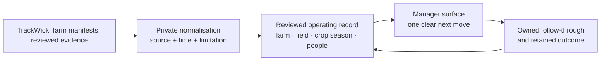

# AGRO CEO operating architecture

**Status:** canonical product and data contract for the Fortune Rice manager
experience.

## The simple model

AGRO CEO turns the current Fortune field programme into an operating loop:

The diagram is intentionally not a pipeline into an opaque score. A source
can add *context*; a named review and evidence gate are required before it
becomes an operating fact.

## The primitives

| Primitive | The stable meaning | Headline metric in the manager view | Never infer it from |
|---|---|---|---|
| **Operating unit** | The Fortune programme or managed operating context. | Current scope, not a performance score. | A public company profile or dashboard label. |
| **Farm** | A reviewed physical operating record. | Area when known; otherwise open field work. | A source village, farmer visit, or coverage count. |
| **Field** | The operational block the team can run as one unit. | Its active crop season and latest reviewed fact. | A GPS point without reviewed provenance. |
| **Crop season** | A crop/cultivar on part of a field in one season. | The next stage/work or evidence gap. | A timeless crop label on a person. |
| **Farmer** | A reviewed programme relationship. | Scoped fields/relationship context. | A visit, `customerIden`, phone number, or purchase line. |
| **Field worker** | A reviewed person with a time- and scope-bound role. | Open work and filed activity, separately labelled. | A productivity row alone. |
| **Inbox item** | A decision, exception, or promise needing follow-through. | Priority, owner, due date, state. | A raw event or notification. |

The durable common key is the **season crop allocation**: crop and cultivar on
a defined part of a field for one season. Work, observations, evidence,
exceptions, interventions, harvest, quality, and learning connect to it when
they have field/crop context.

## The manager experience

There are exactly six top-level views. Each starts with one job and has one
natural action.

| View | Starts with | One thing the manager can do | What stays out |
|---|---|---|---|
| **Home** | India time, local context, three honest operating truths, and the reviewed-field map. | Open the single most important queue. | KPI walls, health scores, and task noise. |
| **Farms** | Reviewed fields, with **Map** as the default and Cards/Table as alternate views. | Open one field record. | Village pins, coverage bubbles, guessed geometry. |
| **Farmers** | Reviewed farmer relationships, as Cards or Table. | Open one relationship. | Unreviewed TrackWick people or CRM detail. |
| **Field workers** | Reviewed workers, as Cards or Table. | Open one worker's scoped record. | A leaderboard or inferred roster. |
| **Inbox** | Decisions first; Priority/All are the only filter. | See the owner and next decision. | An activity stream and duplicate work list. |
| **Settings** | The manager-access boundary. | Unlock or lock private actions. | Operational data editing or source secrets. |

Cards are deliberately small. Each shows the object's name, one headline
metric, and only the characteristics that explain that metric. Opening a card
reveals the same record in place and, for a field, connects the Inbox to the
relevant decisions. There is no separate detail maze.

## The three truths on Home

Home is not a dashboard. It states only the current values that matter to the
COO's operating intent:

| Truth | It can say | It must not say |
|---|---|---|
| **Supply** | *Farmer reach* in the last 14 days; once a manager publishes the seasonal capture, *Purchase share* = Fortune purchase quantity / linked growers' reported harvest. | Reach is purchase share; reported harvest share is regional market share. |
| **Proof** | Number of reported chemical events. | Compliance, residues, or EU-export readiness without the approved schedule, lot/application evidence, and applicable verification. |
| **Crop** | Dated signal observations in the stated window. | Diagnosis, prevalence, treatment efficacy, or a prediction of loss. |

The lead message above those values follows a simple ordering: fresh
high/critical field signal first, then worker filing/coverage failure, then
overdue farmer coverage. It always sends the manager to the view where the
next move belongs.

## Map contract

The visual map is a confidence boundary, not decoration.

- Only manager-reviewed field points or boundaries from a published farm
  manifest can appear as farm records.
- TrackWick task GPS, source villages, programme coverage, procurement
  aggregates, and public company locations never become farm pins.
- An empty map says why it is empty rather than inventing a cluster.
- A field click opens that field's record; it does not expose raw source
  identifiers, people, or coordinates beyond the authorised manager surface.

## Data contract: source to decision

| Layer | What belongs there | Who can change it | What the manager sees |
|---|---|---|---|
| **Private source receipt** | TrackWick response, CSV import, evidence artifact. | Approved server ingest only. | Nothing raw. |
| **Normalised context** | Visit, issue observation, reported pesticide event, officer activity. | Deterministic mapping with source version. | Aggregates and limitations. |
| **Reviewed operating record** | Farm/field geometry, crop season, people and assignments, accepted signals. | Named manager/reviewer through the governed path. | The six object views. |
| **Outcome and follow-through** | Purchase capture aggregate, decision, work, exception, proof, season learning. | Named accountable person. | Home truth or Inbox item. |

The private layer always retains source, observed time, received time, mapping
version, freshness, and limitations. The browser does not receive provider
credentials, task identifiers, raw GPS, mobile numbers, photos, or source
rows.

## What is live, what is gated

| Capability | State | Gate before it becomes live Fortune data |
|---|---|---|
| Manager UI and local non-empty fallback | Ready | None; it is read-only and creates no record. |
| Reviewed farm map/cards/table | Ready in code | Published manager-reviewed farm manifest with geometry provenance. |
| Reviewed people/relationships | Ready in code | Named people, scoped roles, effective dates, and approval. |
| TrackWick read-only context | Adapter verified; import intentionally blocked | Real accountable Fortune manager record plus sanctioned server-only credentials. |
| Purchase share | Ready in code; unavailable by default | One reviewed seasonal harvest/purchase snapshot, reviewed then published. |
| Export-ready proof | Not claimed | Approved kit/schedule, product/lot/application evidence, and any required compliance/lab process. |
| Disease steering | Signal and assignment only | Agronomist review; no automatic diagnosis or treatment recommendation. |

## First real-data handoff

The shortest honest activation sequence is:

1. Name the accountable Fortune manager and create their reviewed people
   record.
2. Publish a farm manifest with stable source IDs and only the verified
   geometry Fortune is permitted to use.
3. Create field, crop-season, and scoped person relationships.
4. Place the TrackWick configuration in server secrets and run a manager
   refresh; the importer fails closed if the owner is wrong.
5. Publish a one-season purchase capture if the business wants to show
   purchase share.
6. Add evidence-backed compliance sources before showing any export claim.

That is enough to make the product more valuable than the current daily
report without pretending to know more than Fortune's data proves.

## Design rules

- Fewer objects, not more tabs.
- One plain-language heading, one primary action, and one visible limitation
  per page.
- Use a map only to place reviewed geometry; use Cards/Table to compare
  objects; use Inbox to decide.
- Translate the interface completely; preserve source-entered names, crop
  varieties, dates, and units as facts.
- A quiet empty state is better than a fictional farm, person, score, or pin.

For the durable schema and detailed evidence rules, use
[PRD-SYSTEM-SPINE.md](PRD-SYSTEM-SPINE.md). For source-specific operational
contracts, use the linked documents in the [FFL documentation index](README.md).
