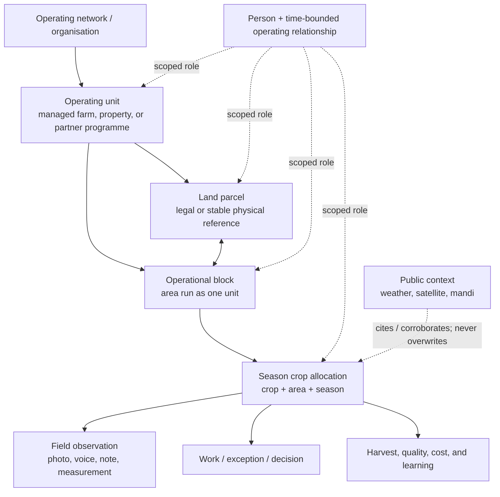

# AGRO CEO system spine

**Status:** proposed product contract for the Fortune pilot and future operating networks
**Audience:** product, operations, agronomy, engineering, and pilot leadership

## The simple answer

AGRO CEO is the shared record of **what is growing in a verified field this
season, what changed there, and who owns the next move**.

The centre of the product is a **season crop allocation**: a named crop and
cultivar on a defined area of an operational block for one season. It is the
one place where field work, observations, evidence, risks, decisions, costs,
harvest, and learning meet.

This is deliberately not a generic farmer CRM, a satellite dashboard, or a
chatbot. Those can be useful inputs or surfaces later. They cannot become a
second source of truth.

## Why this spine exists

The existing PRDs correctly define the farm kernel, operating loop, data
provenance, portfolio scale, regional context, trials, and field
communications. This document makes their shared contract explicit so that a
new view or import cannot introduce a competing centre of gravity.

It does not replace the numbered PRDs. It settles the questions that cross
all of them: what a field is, how people relate to it, where a photo belongs,
which map layers are honest, and what must be true before a record can affect
operations.

## The operating graph

### The non-negotiable meanings

| Thing | It means | It is not |
|---|---|---|
| **Operating unit** | A farm, managed property, or partner programme with its own operating relationship. | A hard-coded Fortune customer or one assumed commercial model. |
| **Land parcel** | A legal or stable physical reference, with rights and boundary evidence where available. | The same thing as an operating block. |
| **Operational block** | The area the team actually manages as one unit. It can span, divide, or change across parcels. | A permanent crop or a person’s identity. |
| **Season crop allocation** | A crop/cultivar on a defined part of a block in one season. This is the operating centre. | A generic crop plan or a timeless field. |
| **Field observation** | What someone or an instrument observed at a stated time, optionally supported by retained evidence. | A diagnosis, recommendation, or automatically accepted work completion. |
| **Person relationship** | A date-bounded responsibility or operating relationship at a stated scope. | A claim that a farmer permanently “owns” a field. |
| **Public context** | Dated weather, remote sensing, mandi, soil baseline, or advisory context with provenance. | Farm truth, a buyer price, or proof that work occurred. |

## Three architecture decisions

### ADR-01 — Crop allocation is the common key

**Decision:** Work, stage checkpoints, signals, exceptions, interventions,
decisions, harvest, quality, trials, and season review bind to a season crop
allocation whenever they have field/crop context.

**Why:** A field can change operator, shape, crop, and role relationships. A
crop allocation keeps the record meaningful through those changes and lets a
manager ask a useful question: “What is happening to this rice allocation now?”

**Trade-off:** A quick record may occasionally be unresolved at first. It must
remain visibly unresolved until a manager supplies the allocation rather than
being guessed into the wrong field.

### ADR-02 — People are flexible relationships, not a rigid farmer hierarchy

**Decision:** Keep a person distinct from their role. Add time-bounded,
scope-bound operating assignments when Fortune provides a real roster:

`person × relationship role × scope × starts/ends × source/provenance`.

Initial roles include grower, landholder, lessee, field operator, manager,
agronomist, buyer contact, and reviewer. A person can have several roles; a
field/block/allocation can have several people. A role is effective only for
its stated dates and scope.

**Why:** Fortune’s contract-farming network, managed properties, and future
partner farms cannot be faithfully represented by “one farmer owns one farm.”
The model supports one grower with many fields, a family or contractor involved
in one field, and changing tenure without a rewrite.

**Trade-off:** Do not introduce a large household, payment, or CRM model now.
Use the existing `people` record plus scoped assignments first. Introduce an
organisation/household party only when an approved source supplies stable IDs
and the pilot needs it.

### ADR-03 — Facts and context are separate layers

**Decision:** The product displays verified operating facts, submitted field
observations, and external context as different layers with their source,
time, resolution, freshness, and confidence/verification state.

**Why:** A weather grid, satellite pixel, village procurement aggregate, or
PIN can be very useful while still not locating a field or proving a crop
condition. Separating layers protects operational judgment and makes the map
credible.

**Trade-off:** The first map can look deliberately sparse until Fortune
supplies reviewed field geometry. That is better than inventing farm pins or a
single opaque “farm health” score.

## The few connected product loops

| Product loop | The user’s shortest path to value | PRD authority | First release boundary |
|---|---|---|---|
| **1. Establish the place** | Set up an operating unit, block, active crop allocation, and who is responsible. | [PRD 00](prds/PRD-00-pilot-mandate.md), [PRD 01](prds/PRD-01-farm-operating-kernel.md) | One reviewed field manifest; no fake geocoding. |
| **2. Run today’s field work** | See the next critical action; capture a small observation or deviation; give it an owner. | [PRD 01](prds/PRD-01-farm-operating-kernel.md), [PRD 02](prds/PRD-02-season-execution-and-learning.md) | Native Hindi/English field PWA and manager review. |
| **3. See the field in context** | Open a field and understand its latest evidence, crop stage, local conditions, and source limits. | [PRD 03](prds/PRD-03-data-and-intelligence-fabric.md), [PRD 05](prds/PRD-05-regional-conditions-service.md) | Verified geometry plus one reviewed IMD context feed; public sources remain context. |
| **4. Learn and repeat** | At harvest or review, compare expected versus observed and promote a practice only with evidence. | [PRD 02](prds/PRD-02-season-execution-and-learning.md), [PRD 04](prds/PRD-04-multi-farm-scale.md), [PRD 06](prds/PRD-06-controlled-trials-and-playbooks.md) | Harvest/quality and season review before portfolio benchmarking. |
| **5. Reduce capture friction later** | Send a specific field prompt or receive evidence without losing the operating record. | [PRD 07](prds/PRD-07-field-communications-whatsapp.md) | WhatsApp is assistive only, after the native loop and consent gates are live. |

The first four loops are the product. The fifth is a channel, not the product.

## A truthful map contract

The map becomes useful as facts arrive. It never makes a claim stronger than
its layer supports.

| Layer | Can show | Required gate | Must never imply |
|---|---|---|---|
| **Verified field** | Private point or boundary, area, allocation, and geometry status. | Stable Fortune source ID, precision, source-recorded time, and boundary/point evidence reference. | A village, PIN, purchase record, or public company footprint is a farm boundary. |
| **Latest observation** | A timestamped observation and evidence availability for the selected allocation. | Allocation, actor, observed time, and required retained evidence. | Photo evidence is a complete diagnosis or a resolved exception. |
| **Conditions** | Official weather/warning or reviewed satellite context for the declared coverage/resolution. | Source registry, successful run, freshness check, and a compatible geography/geometry. | Grid or pixel context is a field-level measurement or agronomic instruction. |
| **Supply network** | Approved aggregate village/variety procurement history. | Purpose-limited aggregate import and review. | Supply villages are current fields, individual farmers, or live production volume. |
| **Market context** | Nearby mandi/commodity/variety information in a field’s economic context. | Official source, date, market, unit, and variety/grade mapping. | A public mandi quote is Fortune’s realised price or a sale recommendation. |

The default map starts with the user’s selected operating unit, then allows a
simple layer switch: **Fields · Observations · Conditions · Network**. No
heatmap, opaque health score, or dense national map belongs in the first
experience.

## What each manager surface is for

The manager navigation is deliberately fixed at six views: **Home, Farms,
Farmers, Field workers, Inbox, Settings**. Crop is a field-and-season record,
not a seventh tab; Map is the Farm default view, not a separate place to get
lost.

| Surface | One job | Show first | Never become |
|---|---|---|---|
| **Home** | Direct the manager to the single most material next move. | India time/weather context, three qualified operating truths, and reviewed-field map context. | An executive KPI wall or a health score. |
| **Farms** | Understand a reviewed field and its crop season. | Map, then Cards/Table; crop, area or open work, and the characteristics behind the metric. | A static land registry or source-village map. |
| **Farmers** | Understand a reviewed operating relationship. | Cards/Table with scoped fields and relationship context. | A public farmer directory or a copied TrackWick roster. |
| **Field workers** | Understand scoped execution capacity. | Cards/Table with open work and separately labelled filing activity. | A leaderboard or inferred people database. |
| **Inbox** | Resolve what needs a human move. | Priority decisions, owner, due time, field, and state; All is the only expanded view. | A task/activity stream that hides operational risk. |
| **Settings** | Govern private access. | Manager access and the boundary around private source actions. | A place to edit source facts or reveal credentials. |

Hindi is the default working language for field capture and field-agent prompts;
the manager surface is English-first and fully Hindi-capable. The underlying
records, units, identifiers, and evidence links are shared, so translation
changes the interface and never changes a source-entered fact.

## Data admission gates

### Field and person records

Before AGRO CEO can show a private field on the map, Fortune supplies an
approved manifest containing stable source IDs and location provenance. The
existing [farm-manifest contract](FARM-MANIFEST-IMPORT.md) is the minimum
shape. Village, district, PIN, and historical procurement data may establish
administrative or network context only.

Before a relationship is published, it needs a stable source identifier or
human approval, scope, role, effective dates, and the source/actor who asserted
it. Names alone never match a person to a field.

### Field observations and evidence

A material observation needs an allocation, accountable actor, observed time,
configured template/version, and any required evidence. Evidence is immutable;
a correction links forward. An uploaded photo without sufficient field context
is reviewable evidence, not a farm fact.

### External data

Every external display needs a registered source, source URL/identifier,
licence/access status, coverage, observation/issue time, received time,
mapping version, freshness target, and failure state. Absent or stale feeds say
so. They never render a plausible placeholder.

## Delivery sequence and proof of value

### Phase A — Make one real allocation legible

1. Fortune approves and imports the field manifest for the first operating
   location(s), including only geography that meets the verification gate.
2. Add scoped people/role assignments for the manager, field operator,
   agronomist, and grower/land relationship needed by that location.
3. Configure the crop allocation, stage checkpoints, first 30 days of work,
   and evidence rules.

**Done when:** a manager can open one allocation and know its place, crop
stage, accountable people, next action, and what proof is missing without a
spreadsheet or a call.

### Phase B — Make field change visible

1. Use the native field PWA for five small, context-specific signal families:
   completion, stage check, exception, input/application, and milestone/harvest
   quality.
2. Review submitted facts through the canonical signal/exception path.
3. Make Home and Actions a narrow queue of late work, exceptions, and evidence
   gaps—not activity counts.

**Done when:** a serious deviation reaches a named owner with its time,
evidence, and allocation context; a closed item has proof or an explicit
reason it does not.

### Phase C — Add useful external context, not more dashboards

1. Enable a reviewed IMD adapter for the real district/field coverage with
   source/freshness labelling.
2. Add AGMARKNET only after Fortune selects relevant markets, commodity,
   variety, grade, and unit mapping.
3. Add satellite context only once reviewed field geometry and a ground-truth
   interpretation loop exist.

**Done when:** a manager can distinguish “it rained in the regional feed” from
“we observed standing water in this allocation,” and both can be cited in a
decision.

### Phase D — Close the commercial and learning loop

1. Keep historical procurement as a private, reviewed village/variety aggregate
   until Fortune deliberately provides source IDs and an approved purpose for
   richer commercial data.
2. Capture actual inputs, harvest, quality, buyer terms, sale, and payment as
   distinct records; never substitute market context for realised economics.
3. Run a season review, then promote only reviewed practices to playbooks.

**Done when:** the team can explain a result with its actual field context,
work, evidence, decision, and measured outcome—not correlation theatre.

## Explicitly deferred

- Real WhatsApp sending/collection until the separately approved, consented
  LoopMessage production gate is complete. It cannot bypass the field PWA or
  review route.
- A national public conditions product until the regional-source rights,
  privacy, and methodology gates in PRD 05 are passed.
- Automated diagnosis, crop recommendations, and a composite health score.
- A household/financial/contract-management suite, broad CRM, payments, or
  farmer marketplace.
- Multi-farm rankings until crop, stage, area, irrigation, soil, weather, and
  operating arrangement are comparable enough to be honest.

## Implementation boundary

Keep one modular monolith and the existing private `agro` schema. The modules
are: operating kernel, season execution, evidence, source/import, portfolio,
and communications. They share the allocation key and append-only audit rules;
they do not create cross-service copies of field truth. Extract a worker or
adapter only when a source or media workflow demonstrably needs it.

## Decisions needed from Fortune to start Phase A

1. Which first operating location and crop allocation should be the pilot?
2. Who may assert/review field geometry, roster relationships, and first field
   observations?
3. Which stable IDs can Fortune export for farm, plot/block, person/role, crop,
   and season?
4. Which three-to-five stage-critical checks matter for that crop this season?
5. Which named manager is the fallback owner when evidence or a response is
   missing?

Once those five answers exist, the product can begin with one real field loop
and expand without replacing its data model.
