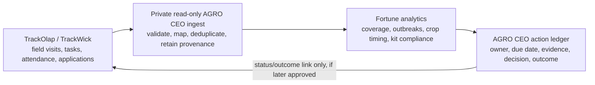

# Fortune TrackOlap / TrackWick integration

**Status:** discovery complete; ready for a read-only source connection once
Fortune supplies a sanctioned service account/API token and the tenant API
contract.

## The answer

TrackOlap/TrackWick is the current operational system of record for the
Fortune paddy visit programme.  AGRO CEO should **read its visit, task,
attendance, crop, issue, and pesticide data**, then turn important signals
into owned follow-up and retained outcomes.  It must not scrape the dashboard,
copy data out of a browser, or replace TrackOlap's field workflow.



The first connection is one-way and read-only.  A later write-back must be a
separate Fortune-approved scope; no AGRO CEO process may create or update a
TrackOlap task, attendance event, pesticide recommendation, or farmer record
by default.

## What was established from the reference dashboard

1. The authenticated Streamlit dashboard is a server-rendered operational
   application, not a static PDF.  It includes a **Pull latest data** action,
   cached server-side data handling, exports via `openpyxl`, and interactive
   Plotly/PyDeck views.
2. The daily report's farmer-code links point to
   `go.trackwick.com/manager/team/task/<opaque-id>/details`.  This directly
   ties the displayed farmer/visit records to the TrackWick tenant.
3. The dashboard's source fetching happens server-side: browser inspection
   exposed Streamlit protocol traffic, not a browser-side TrackOlap data API.
   Therefore browser scraping is both fragile and the wrong integration path.
4. The dashboard source repository is not publicly readable.  Its server-side
   API endpoints, credentials, tenant identifiers, query rules, and custom
   field names cannot be inferred safely from the UI.

These findings show *where* the data currently lives and how the dashboard
uses it, but do not grant AGRO CEO data rights.  TrackOlap's public material
describes API-based integrations and an account API token, while exact
endpoints and permissions must come from Fortune's tenant administrator and
TrackOlap support.

## The dashboard semantics to reproduce exactly

AGRO CEO must first reach parity with these definitions before adding any new
score or recommendation.

| Dashboard output | Required source data and definition |
| --- | --- |
| Daily visits and active officers | Visit submission ID, filing officer ID, submission/visit time, and Fortune's reporting timezone.  "Active" must state whether it means punched in, a filed visit, or both. |
| Missing officers | Officer roster, attendance/punch events, latest **filed** visit, active assignment, and reserve-cover relationship. |
| Major issues / hotspots | Issue-observation ID, issue taxonomy, severity, observation time, farmer/task ID, village reference, filing officer, and attribution.  Seven-day totals are detections, not confirmed unresolved outbreaks. |
| Coverage | Farmer/task population, kit-taken status, last valid visit, territory owner, and the explicit rule: **overdue = never visited or no visit in 14 days**.  Recent is a subset of visited; never visited is a subset of overdue. |
| PO performance | Keep `filing_officer_id` separate from `territory_owner_id`.  The reference dashboard explicitly counts the person who filed the visit, not the PO who owns the farmer's territory. |
| Crop-timing analysis | Transplant date, crop/variety, issue observation date, and a stable farmer/field reference.  Prevalence needs the denominator (all farms in the timing cohort); raw case count alone is shaped by scouting coverage. |
| Pesticide compliance | Proposed-kit version, product catalogue, approved target issue/effectiveness mapping, planned DAT window, recommendation/application event, application date, and transplant date. |

The 03 Aug 2026 example demonstrates why these semantics matter: a very low
visit count and few active filing officers can make "zero reports today" an
absence of observation, not evidence that a pest or disease has receded.

## Minimal read-only feed contract

The preferred integration is a documented TrackOlap API with incremental
watermarks.  A scheduled Fortune-approved CSV export is the valid fallback if
the tenant API cannot expose the required objects.

Every record must contain a stable source ID, `source_updated_at`, received
time, source object type, and tenant/account identifier.  AGRO CEO retains the
source reference and mapping version; it never uses a display name as a join
key.

| Feed | Minimum fields | AGRO CEO use |
| --- | --- | --- |
| Officers and assignments | `officer_id`, name, role, active status, territory/PO ID, effective dates | Scoped people/role candidate; coverage accountability |
| Attendance | `attendance_id`, `officer_id`, punch status, punched-in/out time, source time | Coverage confidence and management attention |
| Farmers / visit tasks | `task_id`, farmer source code, territory/PO ID, village ID/name, active status, kit status, crop/transplant date if held here | Programme/member context; coverage denominator |
| Visits | `visit_id`, `task_id`, filing officer ID, performed/submitted time, completion status, photos/evidence references if approved | Attributable field observation and coverage calculation |
| Issue observations | `observation_id`, `visit_id`, issue code, severity, observed time, notes/evidence reference | Source-backed issue candidate, outbreak context, review queue |
| Products and applications | product ID/name, kit version, approved target issue mapping, recommendation/application IDs, task ID, officer ID, event date | Human-reviewed kit compliance and agronomy review |

Precise farm geometry, phone numbers, Aadhaar, payment data, and raw employee
GPS history are **not** required for dashboard parity and must be excluded from
the first feed.  A village or task location may support aggregate outbreak or
coverage context; it must never be presented as a verified parcel boundary.

## How AGRO CEO uses the feed

1. A private worker requests only approved objects with a saved watermark.
2. It validates schema, dates, source IDs, issue and product taxonomies, then
   quarantines ambiguous or malformed records instead of guessing.
3. It publishes a truth-labelled source-backed observation or context
   candidate.  A TrackOlap task does not automatically become a verified farm,
   crop allocation, land right, or completed field action.
4. The COO brief combines coverage confidence and issue data.  For example,
   it says "outbreak visibility is low because inspection coverage fell," not
   "the outbreak is resolved" when reports fall to zero.
5. A manager/agronomist assigns a response, reviews evidence, and records the
   outcome.  Those AGRO CEO decisions are separate from the source record and
   retain their accountable owner.

## When this becomes live

| Phase | Exit condition |
| --- | --- |
| **0. Access review** | Fortune names the data owner, approves purpose/retention, and creates a read-only service account/API token with no write, GPS-history, or payment scope. |
| **1. Parity sandbox** | A bounded historical export/API window reproduces one agreed daily report and dashboard totals, including the 14-day coverage rule and timezone.  Any difference is reconciled and documented. |
| **2. Daily source lane** | Incremental sync, idempotent replay, source-run health, freshness target, schema-drift quarantine, and manager-visible failure state work in the private environment. |
| **3. Operating loop** | Approved issue/coverage signals create reviewable action candidates; human-owned responses and outcomes are used in the COO brief. |
| **4. Optional write-back** | A separately approved action supports a narrow status/outcome link to TrackOlap.  It is never enabled by the read-only integration. |

## Exact access request for Fortune / TrackOlap

Ask the tenant administrator for the following, once, through the normal
credential channel (never chat or a browser client):

1. Tenant/base URL and an API reference or a supported export specification.
2. A dedicated **read-only** integration user and API token, scoped to the six
   feeds above and the Fortune paddy project only.
3. Object names/endpoints, pagination/rate-limit rules, timestamp semantics,
   and a way to filter by `updated_since`.
4. A data dictionary for custom task/visit fields: issue taxonomy/severity,
   transplant date, kit status/version, product, recommendation, application,
   territory owner, and reserve cover.
5. A one-time bounded historical extract (at least the reporting period used
   for parity) and an agreed daily refresh time/timezone.
6. A named Fortune data owner who can approve mappings, reconcile metrics, and
   decide which evidence links are eligible for private retention.

Until those six items are supplied, the honest state is **integration designed,
not connected**.  The dashboard password provides access to the reference
surface, not permission or credentials for TrackOlap's underlying account.

## AGRO CEO connection configuration

The implemented lane has two deliberate modes, both private and manager-only:

1. `POST /api/v1/trackolap/imports/csv` accepts one reviewed ZIP bundle of the
   six CSV feeds plus its explicit field mapping. It retains one private,
   content-addressed evidence artifact and creates normalized source rows. A
   manager must review and publish an all-valid bundle before it appears in
   `/api/v1/trackolap/metrics`.
2. `POST /api/v1/trackolap/refresh` is an operator-triggered API refresh. If
   configuration or credentials are absent, it records `unavailable` and makes
   **zero** network requests. It accepts only configured HTTPS `GET` calls;
   there is no write method, scheduler, browser credential, or fallback URL.

Set these values only in the server-side secret/configuration environment:

```text
FFL_TRACKOLAP_ENABLED=true
FFL_TRACKOLAP_API_CONFIG_JSON={...reviewed JSON below...}
FFL_TRACKOLAP_API_TOKEN_REFERENCE=env://FFL_TRACKOLAP_API_TOKEN
FFL_TRACKOLAP_API_TOKEN=<runtime secret, never browser-visible>
```

`FFL_TRACKOLAP_API_CONFIG_JSON` must name all six feeds, the tenant’s approved
HTTPS host, a non-empty project scope, exact relative endpoint paths, response
envelope paths, GET-only pagination parameters, timezone, and the full mapping
manifest. This is a **redacted shape**, not a guessed TrackOlap contract:

```json
{
  "tenant_id": "fortune-paddy",
  "base_url": "https://approved-trackolap-host.example",
  "allowed_hosts": ["approved-trackolap-host.example"],
  "reporting_timezone": "Asia/Kolkata",
  "read_only": true,
  "project_scope": {"project_id": "fortune-paddy-2026"},
  "mapping_manifest": {
    "version": "fortune-paddy-v1",
    "feeds": {
      "visits": {
        "source_id": "<approved visit ID column>",
        "source_updated_at": "<approved update timestamp column>",
        "tenant_id": "<approved tenant column>",
        "visit_id": "<approved visit ID column>",
        "task_id": "<approved task ID column>",
        "filing_officer_id": "<approved filing-officer column>",
        "performed_at": "<approved visit-time column>",
        "submitted_at": "<approved submission-time column>",
        "visit_status": "<approved status column>"
      }
    }
  },
  "endpoints": {
    "visits": {
      "path": "/<approved relative visits path>",
      "method": "GET",
      "rows_path": "<approved.rows.envelope.path>",
      "next_cursor_path": "<approved.next.cursor.path>",
      "cursor_param": "<approved_cursor_parameter>",
      "page_size_param": "<approved_page_size_parameter>",
      "page_size": 100,
      "max_pages": 100
    }
  }
}
```

The configuration must include the analogous, approved mapping and endpoint
objects for `officers`, `attendance`, `farmer_tasks`, `issue_observations`, and
`pesticide_events`; the application rejects an incomplete configuration. It
does not return the config, token reference, token, endpoint, cursor, source
task URL, raw provider response, GPS history, contact details, or payment data
to the browser.
