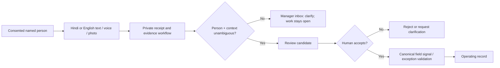

# WhatsApp intake brief — draft only

**Status:** product contract for a later, separately approved WhatsApp rollout. It enables nothing: no number, credentials, template, webhook, message, or customer data is configured by this brief.

## The job

Make it easy for a known farmer or field agent to report what changed in a known block, in Hindi or English, while keeping the native Field Ledger PWA available when WhatsApp is unavailable.

WhatsApp is an assistive operating channel. It is not the FFL system of record:

- delivery/read receipts never complete work, resolve an exception, make a decision, or publish agronomic advice;
- every incoming item is a reviewable candidate until its person, farm/block/allocation, observed time, and required evidence are unambiguous;
- an accepted candidate still goes through the canonical signal/exception validation path;
- a group chat is not an evidence source. Start with consented, individually attributable numbers only.

FFL will use LoopMessage directly when this work is approved. Hermes/personal-assistant is learnings-only: no Hermes code, service dependency, authentication, user data, sender, number, or credentials enter FFL.

## First four asks

| Trigger | Hindi for farmer / field agent | English manager record | Required context |
|---|---|---|---|
| Daily change | `आज [खेत] में क्या बदला? फोटो या voice note भेजें।` | What changed in [block] today? Send a photo or voice note. | named block + observed time |
| Work proof | `[काम] पूरा हुआ? हाँ / नहीं लिखें; जरूरी हो तो फोटो भेजें।` | Was [work] completed? Reply YES/NO; attach required proof. | assigned work + proof rule |
| Local weather observation | `आज बारिश हुई? कब और कितनी देर? voice note भी चलेगा।` | Did it rain locally? When and for how long? | named farm/block + observed time |
| Problem report | `कीट, पानी, बीमारी या मशीन की समस्या: खेत का नाम और फोटो भेजें।` | Report pest, water, disease, or machine issue: block name + photo. | named block + photo/voice/text |

`YES`/`NO` and agreed Hindi equivalents may be parsed only as constrained text conventions after a prompt has established the context. FFL makes no claim that provider interactive buttons or quick replies exist.

## Human and evidence flow

Voice, photo, and files must be retained through the private evidence lifecycle before an evidence-required candidate can be accepted. A remote attachment URL alone is not proof. Receipt time and field-observed time remain separate.

## Gates before a separate enablement PRD

1. Named operating farm, block/allocation context, field-owner roster, and consent/opt-out history.
2. A dedicated FFL sender, approved production WhatsApp template ID, sandbox capability proof, and sender binding on callbacks.
3. Provider-specific webhook authorisation kept separate from provider API credentials; private durable receipt, atomic idempotency, recovery worker, and alerting.
4. Hindi/English template review by field operations; plain-text clarification and no-response fallback paths.
5. Manager review route that exposes only linked, redacted context and evidence metadata—not a general conversation archive.
6. Explicit pilot approval before any real outbound message or inbound production acceptance.

Until all six pass, FFL may show this intake design but must not send, ingest, or automate WhatsApp activity.
