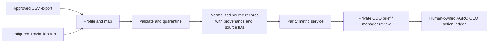

# TrackOlap dual-ingest design

## Goal

Add a private, read-only TrackOlap/TrackWick source lane to AGRO CEO. It ingests both a Fortune-approved historical CSV export and the same records from a configured live API, normalises them identically, and proves dashboard-metric parity before creating any operational action candidate.

## Scope

The first delivery contains three bounded capabilities:

1. **CSV parity import.** A manager submits a ZIP or individual CSV files for the six defined feeds. The application profiles every file, validates rows, retains private evidence, and records an immutable import batch and quarantined rows. A source task never becomes a farm, parcel, allocation, land right, completed work item, or pesticide decision.
2. **Live API refresh boundary.** A server-only adapter uses a pre-reviewed, explicit tenant API configuration and read-only secret reference. It uses a source cursor/watermark and returns the exact same raw feed rows as the CSV importer. Without complete approved configuration or a credential, it records an unavailable source run and makes no HTTP request.
3. **Dashboard-parity read model.** One calculation service produces the coverage, visit, officer-activity, issue, crop-timing, and pesticide metrics from either normalized path. It includes freshness and observation confidence, so a fall in observations is never shown as a fall in risk.

The delivery does not add a public dashboard, background scheduler, automatic pesticide recommendation, field geometry, employee GPS history, phone/payment/identity data, or TrackOlap write-back.

## Reference definitions

The source lane preserves these Fortune dashboard rules:

- A daily visit is grouped by reporting timezone and filing officer.
- A farmer is overdue when never visited or without a valid visit in the last fourteen days. Never visited is a subset of overdue; recent is a subset of ever visited.
- `filing_officer_id` and `territory_owner_id` are separate fields and are never silently substituted in a PO aggregate.
- An issue total counts dated source observations in the selected window, not confirmed unresolved outbreaks.
- Issue prevalence uses a crop-timing cohort denominator; raw cases and prevalence are distinct metrics.
- Kit timing uses configured kit version, product, application date, transplant date, and approved DAT window. An off-kit result is a review cue, not an instruction or compliance verdict.

## Architecture

## Components

`ffl.integrations.trackolap.contracts` defines immutable normalized records, source-feed names, accepted field types, cursor state, and validation results. It contains no HTTP, database, or FastAPI code.

`ffl.integrations.trackolap.mapping` maps one raw CSV/API object into a normalized record. It validates opaque stable IDs, timezone-aware timestamps, feed names, and required identifier links. It returns row errors rather than guessing an ID or taxonomy.

`ffl.integrations.trackolap.csv_ingest` parses UTF-8 CSV source files with an explicit filename-to-feed manifest and bounded ZIP archives. It passes raw row dictionaries to the shared mapper.

`ffl.integrations.trackolap.api` defines `TrackolapApiConfig` and `TrackolapApiAdapter`. Configuration supplies endpoint paths, request parameter names, response envelope paths, cursor location, authentication header/prefix, project scope, and page-size rule. This prevents invented TrackOlap endpoints, request shapes, or authentication schemes.

`ffl.services.trackolap_ingest` owns source registration, import/source-run persistence, evidence retention, idempotency, and common result counters. CSV import and API refresh call the same mapper and persistence routine.

`ffl.services.trackolap_metrics` computes the dashboard-parity read model from normalized published rows. It returns values plus source window, timezone, population denominator, freshness, and observation-confidence warnings.

`ffl.api.trackolap_routes` exposes manager-only endpoints to profile/submit an export, view safe source health, and obtain aggregate parity metrics. It never returns credentials, raw provider payloads, task URLs, exact GPS, phone numbers, or evidence content.

## Feed contract

Each row has `source_id`, `source_updated_at`, `tenant_id`, and one feed name:

| Feed | Required normalized fields |
| --- | --- |
| `officers` | `officer_id`, `display_name`, `role`, `active_status`, `territory_owner_id`, `effective_from` |
| `attendance` | `attendance_id`, `officer_id`, `punch_status`, `observed_at` |
| `farmer_tasks` | `task_id`, `farmer_code`, `territory_owner_id`, `village_key`, `task_status`, `kit_status` |
| `visits` | `visit_id`, `task_id`, `filing_officer_id`, `performed_at`, `submitted_at`, `visit_status` |
| `issue_observations` | `observation_id`, `visit_id`, `task_id`, `issue_code`, `severity`, `observed_at` |
| `pesticide_events` | `event_id`, `task_id`, `product_code`, `event_kind`, `occurred_at`, `kit_version` |

Optional crop-timing fields (`transplanted_at`, `crop_name`, `cultivar`) and kit-efficacy/DAT fields are admitted only when the approved tenant dictionary names their source fields and accepted values. Metrics report their absence rather than estimate them.

## Persistence and lifecycle

The source registry uses `trackolap-fortune-paddy` with authority `partner`, purpose `Fortune paddy field-operations context`, and a mapping version chosen by the Fortune data owner. CSV source files are retained as private evidence with a content hash. API payloads are normalized in memory; the app persists the source run, selected normalized values, source IDs, validation state, and cursor, but not a raw provider payload.

Rows move through `received → profiled → valid | quarantined → reviewed → published`.

A source run moves through `pending → succeeded | unavailable | failed | quarantined`.

Replaying the same CSV hash or API source ID plus unchanged `source_updated_at` is idempotent. A changed source record is a linked revision; it never overwrites an approved AGRO CEO decision or field evidence.

## API configuration and security

Production configuration contains only server-side references:

- `FFL_TRACKOLAP_ENABLED=true`
- `FFL_TRACKOLAP_API_CONFIG_JSON=env://FFL_TRACKOLAP_API_CONFIG_JSON`
- `FFL_TRACKOLAP_API_TOKEN=env://FFL_TRACKOLAP_API_TOKEN`

The reviewed JSON configuration identifies tenant, base URL, six endpoint contracts, headers, pagination, timezone, feed-field mapping, and project scope. It must use HTTPS, an allow-listed host, and a `read_only` capability declaration. The app rejects a config with missing feeds, empty scope, non-HTTPS URL, non-allow-listed host, or any declared write method.

The browser receives neither token nor source task URL. The first adapter supports only GET. A live refresh is an operator-triggered private action; scheduling is out of scope.

## Failure handling

| Condition | Required result |
| --- | --- |
| Adapter disabled, config absent, or token absent | `unavailable` source run with safe reason; no network request |
| Response schema or taxonomy drift | `quarantined` run/rows with mapping version and reason counts |
| Network/HTTP failure | `failed` source run with no response body retained |
| Duplicate CSV or unchanged source revision | Idempotent result; no duplicate metrics |
| No visits / insufficient denominator | Observation-confidence warning; zero cases is not resolution |
| No approved FFL allocation mapping | Preserve source/context row; do not create a canonical farm fact |

## Acceptance checks

1. A six-file fixture import creates source/import records with valid and quarantined counts, retaining no forbidden personal/GPS fields.
2. The same fixture through a fake live adapter yields equivalent normalized records and metric results.
3. A missing token yields `unavailable` and the HTTP test transport receives zero requests.
4. Configured API pages advance a cursor and deduplicate replayed source IDs.
5. Metrics prove the fourteen-day coverage rule, distinguish filing officer from territory owner, and surface low-observation confidence.
6. Unmapped issue/crop-timing or kit fields are reported unavailable, not inferred.
7. Route tests prove manager endpoints return aggregate metrics only and never expose configuration or provider secrets.

## Delivery order

1. Build contracts/mapping and CSV fixture parity.
2. Persist source/import state and expose safe profile/review endpoints.
3. Build parity calculations and warnings with deterministic tests.
4. Add generic config-bound live API adapter and fake transport tests.
5. Connect a tenant after Fortune supplies approved API configuration, token, historical reconciliation export, and named data owner.
