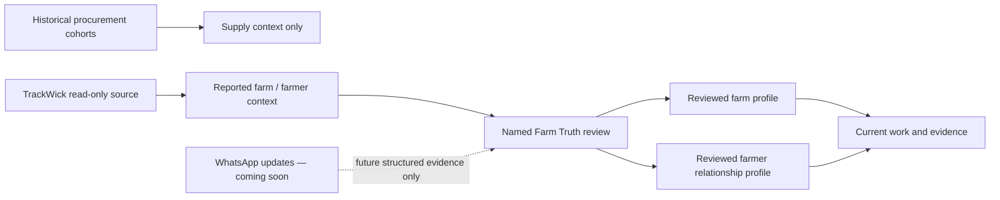

# Farm and Farmer Profiles design

## Purpose

Give Fortune one calm record for each farm and one calm record for each farmer
relationship. These records must make the existing historical procurement
context useful now, accept live field context when TrackWick is configured,
and remain accurate while Fortune progressively reviews source evidence.

This is the next product slice after Farm Truth. It makes the **Fields** and
**Farmers** tabs useful without turning them into a dashboard, CRM, or a raw
source-data viewer.

## Product decision

We will use a shared, farm-first profile model.

- A **Farm profile** is the primary operating record. It starts with one
  current state, then shows its reviewed field/crop/work facts and clearly
  separated reported source context.
- A **Farmer profile** is a scoped operating relationship. It shows the farms
  the person is reviewed to operate with and their current work/context. It
  is not a contact record, ownership claim, or customer profile.
- A farmer can be related to several farms. A farm can have several people
  with different scoped roles over time. Neither direction is hard-coded as
  one-to-one.
- Field workers are intentionally deferred. Their existing source context
  remains on the Farm Truth workflow until the dedicated field-worker slice.

## Three data layers

Every profile carries its data state in plain language instead of a score.

| Layer | Can appear on a profile | Cannot imply |
|---|---|---|
| Historical supply context | Aggregated purchase quantity, month, village and variety cohort. | That a person, farm, crop, or boundary is known. |
| Reported field context | TrackWick-reported farm candidate, source work, activity date and photo reference count. | A Fortune farm, field boundary, person relationship, recommendation, or completed work. |
| Reviewed operating truth | Canonical parcel/block/allocation, person relationship, rights, evidence-backed work and published geometry. | Facts missing from the reviewed record. |

The profile always prefers reviewed truth. If it has only reported context, it
uses the word **Reported** and offers the manager one review action. If it has
only history, it says that historical purchases describe supply context, not
the farm network.

## Experience

### Fields: farm profiles

The Fields tab has one subject: farms.

1. The default card list uses reviewed farms when any exist. Otherwise it
   shows the small TrackWick-reported farm list with the explicit review
   boundary.
2. Opening a card uses an in-place profile panel, not a new dashboard. Its
   header has a name, review state, one current fact, and one primary action.
3. The profile body is three compact modules: **Now** (active crop/open work),
   **People** (reviewed growers/operators only), and **Record** (dated
   evidence and a limitation). A location module appears only when reviewed
   geometry is published.
4. A reported farm has a small source-context profile instead: place label,
   reported area/plot count, last activity, reference counts, and **Review in
   Farm Truth**. It never renders a source coordinate, remote image, phone,
   raw form, or a farm boundary.

### Farmers: relationship profiles

The Farmers tab has one subject: people.

1. It defaults to reviewed grower relationships. If none exist, it shows
   TrackWick-reported people with the source boundary intact.
2. Opening a reviewed farmer shows a compact relationship profile: linked
   farms, active crop/work context, effective role/date, and the next action.
3. Opening a reported farmer shows only the count/label of reported farm
   candidates, latest activity, photo reference count, and **Review in Farm
   Truth**. It does not create an account or expose contact data.
4. Source person records cannot become AGRO CEO logins. A named manager
   creates a login only through the existing access workflow after deliberate
   confirmation.

### Home and Settings

Home stays a single current message. It chooses, in order: a canonical open
action, a reported farm awaiting review, then the published historical
procurement context. It does not gain a second feed or a profile directory.

Settings shows the status of the three layers, including a visibly muted,
non-interactive **WhatsApp updates — Coming soon** row. This means the
connector has not been launched and cannot be used as a source of record.

## Data flow and boundaries

- APIs stay manager-authorized and return only the minimum profile material.
  No provider identifiers, contacts, raw payloads, remote media URLs or raw
  coordinates leave the private source lane.
- A purchase aggregate may be joined only at its named cohort dimensions; it
  is never attached to an individual farmer or farm absent a reviewed link.
- The browser never receives source credentials or arbitrary event payloads.
- Maps show published reviewed geometry only. A source point is never turned
  into a farm pin.
- WhatsApp, when separately enabled later, can create a reviewable candidate
  or evidence request; delivery/read status never changes work state and
  never publishes an agronomic recommendation.

## Error and empty-state behaviour

- No reviewed farms: show reported source context when present, otherwise an
  honest empty state with the single Farm Truth path.
- No TrackWick configuration or failed sync: keep historical procurement
  context visible and state that live field context is not connected. Do not
  fabricate a farm/profile.
- No profile facts: omit the module rather than rendering zero-heavy cards.
- Any unreviewed ambiguity routes to Farm Truth; it does not produce a
  canonical object, login, map marker, action completion, or advice.

## Implementation slices

1. Add a small profile DTO/service for canonical farms and grower
   relationships, plus source-context variants that use the existing
   manager-only TrackWick board material.
2. Add manager-only profile routes with strict state/ID validation and tests
   for redaction and review-state separation.
3. Turn the existing Fields and Farmers cards into accessible in-place
   profile panels. Retain their useful empty states and add the muted
   WhatsApp-coming-soon row in Settings.
4. Add focused regression tests for data precedence, cardinality, history
   non-attribution, raw-source redaction, and disabled WhatsApp presentation.

## Non-goals

- No new field-worker product surface in this slice.
- No map built from villages, purchase cohorts, TrackWick points, or inferred
  locations.
- No live TrackWick call, credentials, source import, or source backfill.
- No WhatsApp send/receive activation, number, template, or webhook change.
- No farm-health score, autonomous agronomy, leaderboard, or generic CRM.

## Success criteria

When Fortune has reviewed records, a manager can open a farm or farmer card
and understand, in one screen, what is true now, who/what is related, what
needs attention, and which fact remains only source context. Before that
review, the same screens stay useful by showing the accurate reported or
historical state without presenting it as truth.
