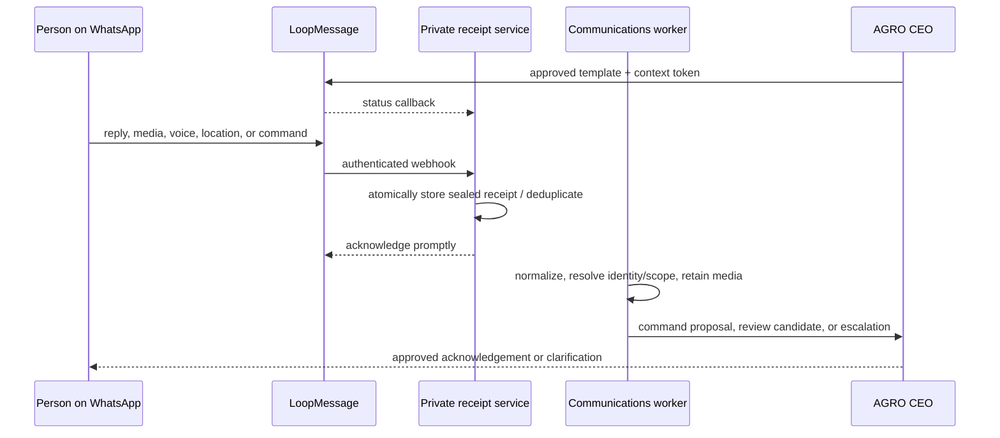

# WhatsApp communications control plane design

**Status:** proposed for review
**Date:** 2026-08-07
**Scope:** Fortune / AGRO CEO operating communications

## Decision

AGRO CEO will treat WhatsApp as a governed communications surface, not as a
generic chatbot or an alternate system of record.

It has two deliberately different experiences:

1. **Owner and admin command AGRO CEO.** A verified owner or admin can read
   operating state, propose and confirm changes, manage communication
   workflows, and run governed campaigns from WhatsApp.
2. **Farmers and field workers operate through structured interactions.** They
   receive concise, contextual prompts and can submit observations, evidence,
   deviations, location, voice notes, or callback requests. Their messages
   become attributable candidates or evidence; they never silently change a
   work item, crop decision, or farm fact.

The existing LoopMessage receipt, evidence, candidate, and delivery foundation
remains useful. This design expands it into a role-aware communications control
plane. It supersedes the *scope boundary* of [PRD 07](../../ffl/prds/PRD-07-field-communications-whatsapp.md), while retaining its evidence and human-review
requirements.

## Why this exists

The current product has the records needed to run farming operations: people,
time-bounded operating relationships, farms/blocks, season crop allocations,
work, field information requests, evidence, exceptions, and decisions. It also
has a deliberately disabled WhatsApp lane with verified webhooks, idempotent
receipts, a private worker, consent records, and candidate review.

What it does **not** yet have is the contextual layer that answers:

- Who is messaging: an owner, admin, farmer, field worker, or unknown person?
- Which operating relationship and allocation make a given response valid?
- What can that person read, change, receive, or send?
- Which message is a reply to which request when one person has many farms or
  several outstanding asks?
- How can an admin request a campaign without bypassing consent, approved
  templates, quiet hours, delivery controls, or the operating record?

This design supplies that layer.

## Product principles

1. **Identity, access, and operating scope are separate facts.** A phone
   number is not a role, a portal login is not a farm relationship, and a
   farmer relationship is not ownership.
2. **Every field-facing interaction is allocation-aware.** A response is linked
   to an exact interaction token, request, work item, or reviewed context. The
   system must never choose the most recent open prompt merely because it looks
   plausible.
3. **WhatsApp is a control and capture channel; AGRO CEO remains the record.**
   Provider delivery/read events are not consent, work completion, evidence,
   or a farm decision.
4. **Owners/admins can command directly, but commands are typed and audited.**
   Natural language and voice create a constrained action proposal; policy and
   canonical domain validation decide whether it can execute.
5. **Campaign scale does not weaken consent.** A campaign is a versioned,
   approved message to a frozen eligible audience—not an unbounded send to a
   contact list.
6. **The native PWA remains a complete fallback.** WhatsApp may be unavailable,
   unsuitable, declined, or delayed.
7. **No raw source contacts become recipients automatically.** TrackWick or
   other source contacts become messageable only after canonical person,
   endpoint verification, scope, and purpose consent are explicitly reviewed.

## Terms

| Term | Meaning |
|---|---|
| Portal role | Application authority: `owner`, `admin`, `farmer`, or `field_worker`. |
| Operational relationship | Effective-dated relationship from a person to an operating unit, parcel, block, or crop allocation, such as grower or field operator. |
| Communication profile | The reviewed, tenant-scoped policy record that makes a person eligible for communications. It is not a CRM contact dump. |
| Endpoint | One verified WhatsApp-capable E.164 number assigned to one canonical person. A shared number is not automatically attributable. |
| Interaction | One recipient-specific outbound ask or inbound context, such as a weekly crop check-in for one allocation. |
| Workflow | A versioned rule defining a recurring or event-driven operational interaction. |
| Campaign | A one-time or scheduled, owner/admin-initiated broadcast execution with a frozen audience snapshot. |
| Command proposal | A structured, validated change prepared from an owner/admin message and executed only after the policy-required confirmation. |

## Authority model

### Three gates for every message

Every inbound and outbound action resolves these facts independently:

1. **Endpoint identity:** the endpoint is verified, active, assigned to the
   canonical person, and belongs to the selected customer portal.
2. **Portal authority:** the person has an active portal membership and one of
   the four portal roles.
3. **Effective operating scope:** where field context is involved, the person
   has an active reviewed relationship that covers the requested allocation,
   block, parcel, or operating unit at the event time.

An endpoint can be technically valid while ineligible to receive a particular
message because its consent, membership, relationship, allocation, or workflow
enrollment is inactive. The resolution result is one of:

`unknown`, `known_unverified`, `known_ineligible`, `ambiguous_scope`,
`eligible_owner`, `eligible_admin`, `eligible_farmer`, or
`eligible_field_worker`.

Only an eligible result can take an automatic route. All other cases enter a
safe review queue and receive no contextual farm data.

### Role policy

| Capability | Owner | Admin | Farmer | Field worker |
|---|---:|---:|---:|---:|
| Read permitted operating summaries | Yes | Yes | Own scoped farm/crop context | Own scoped work/context |
| Create/correct canonical operational records | Yes | Yes, in portal scope | No | No |
| Accept/reject field candidates | Yes | Yes | No | No |
| Draft/edit workflow or template policy | Yes | Yes, in portal scope | No | No |
| Launch/pause/cancel campaigns | Yes | Yes, subject to campaign policy | No | No |
| Receive escalations/approval requests | Yes | Yes | Callback/status only | Callback/status only |
| Submit observation, evidence, deviation | Optional | Optional | Yes | Yes |
| Close work or publish agronomic advice by reply | No automatic closure | No automatic closure | No | No |

Owners and admins have direct WhatsApp write authority over normal operating
data and communications. The following remain protected even for them:

- credentials, signing keys, provider configuration, and raw receipts/media;
- destructive bulk deletion or mutation of immutable evidence/audit history;
- portal owner elevation, cross-customer access, and other security actions;
- sends that exceed the configured risk threshold without the required owner
  or second-approver confirmation.

This is a safety boundary, not a reduction of day-to-day admin authority.

### Command confirmation policy

An owner/admin command is parsed into a typed proposal, validated against the
current record, and rendered back with its exact effect. Confirmation happens
in WhatsApp by replying to the proposal with a short-lived opaque confirmation
token.

| Risk class | Examples | Required confirmation |
|---|---|---|
| Routine | Read query; assign one work item; request a callback; edit a draft workflow. | Initiator confirms. |
| Material | Correct a field record; create a work batch; launch a small operational campaign. | Initiator confirms with full diff/audience preview. |
| High impact | Large campaign, new audience rule, safety-sensitive copy, multi-farm bulk update. | Owner confirmation; optional second approver according to portal policy. |
| Restricted | Credentials, membership/owner change, exports of protected content, deletion of immutable records. | Not executable through WhatsApp. |

The confirmation is never a vague `yes`; it binds the proposal ID, actor,
expiry, scope, version, and expected record state. A changed audience,
template, policy, or record version invalidates the proposal.

## Role-specific experiences

### Owner and admin: AGRO CEO command channel

Owners and admins can send text or voice commands such as:

- “What field evidence is overdue today?”
- “Move the Dadri irrigation exception to Ajay and ask him to call the farmer.”
- “Ask all eligible active rice farmers in Dadri for a photo and any pest
  issue this week.”
- “Pause the weekly farmer check-in workflow.”

The command agent may retrieve a role-scoped summary and produce a structured
proposal. It must not use an LLM as an authority source or give it arbitrary
database access. A command resolves to an allow-listed operation with typed
arguments, policy checks, canonical service calls, and an audit event.

Voice is transcribed as a draft command. The original voice artifact and the
transcription remain attributable, but a transcription cannot execute until
the owner/admin confirms the rendered proposal.

### Field worker: work and evidence loop

Field workers receive only requests they are actively scoped to receive:

- assigned work prompt and proof/evidence request;
- stage-critical reminder;
- safety or material-exception escalation;
- callback coordination.

They can reply through provider-supported structured choices or constrained
text, attach photos/documents/voice, share location, report a deviation, ask
for a callback, ask for help, or opt out. A `YES`/`NO` reply is meaningful only
when the interaction that requested it is unambiguous. It never completes a
work item automatically.

### Farmer: farm-specific check-in and reporting loop

Farmers receive farmer-appropriate requests only when they have a current,
reviewed relationship to the allocation and purpose-specific consent:

- weekly “what changed?” check-in;
- crop-stage question;
- local rainfall/weather observation;
- photo/voice evidence request;
- pest, disease, water, or machine issue reporting;
- callback/status acknowledgement.

An ordinary farmer message may identify a problem but is not an automatic
diagnosis or prescription. A manager/agronomist reviews it through the normal
exception/signal path. Automated agronomic recommendations, inputs,
financial commitments, and harvest commitments are outside this release.

### Unknown, shared, revoked, and ended endpoints

An unregistered or ambiguous number must never receive a response that reveals
farms, people, crops, work, or whether a number exists in AGRO CEO. It creates
a redacted review case or, where policy permits, receives a generic support
instruction. A shared/family phone is not usable for automatic attribution or
owner/admin command authority. Ending a relationship, suspending a membership,
disabling an endpoint, or revoking consent immediately blocks outbound sends
and makes any inbound item review-only.

## Editable workflows and campaigns

### Workflow definition

Workflows are the editable operating product behind automated asks. A workflow
version contains:

- name, purpose, owner, status, and explicit approval history;
- trigger: schedule, crop-stage checkpoint, missing evidence, exception,
  overdue work, manager command, or separately approved external signal;
- audience rule over active communication profiles and operating scopes;
- recipient context cardinality: person, farm, block, or allocation;
- consent purpose, channel, locale, time zone, quiet hours, frequency cap, and
  fallback route;
- approved provider template/version, parameter schema, Hindi/English copy,
  and allowed response types;
- evidence and response requirements, response deadline, escalation owner,
  no-response rule, and deduplication rule.

Editing creates a new version. Existing interaction runs retain the exact copy,
template, audience, and policy that applied when they were sent.

### Weekly farmer check-in

The first farmer automation is a bounded weekly check-in. It evaluates every
eligible `farmer × active allocation` pair, rather than sending one vague
message to a farmer with several fields. The message names the contextual farm
or block, asks the approved short set of Hindi/English questions, and carries
an opaque interaction context. It may request a photo, voice note, and local
observation time.

If a person has several eligible allocations, the product may send separate
interactions or a provider-supported selector. It must not guess which
allocation an unscoped photo belongs to.

### Campaigns

A campaign is an owner/admin-managed execution, separate from recurring
workflow definitions. Creation performs an audience evaluation but does not
send immediately. The initiator sees:

- audience rule in human terms and its exact version;
- eligible, suppressed, excluded, and ambiguous counts with reasons;
- an audience snapshot ID and small redacted sample for validation;
- approved template, locale coverage, variables, send window, rate limit, and
  frequency impact;
- required approvals and cancellation control.

After the required confirmation, the audience snapshot is immutable. A
campaign may be paused or cancelled, but recipient eligibility is re-checked
immediately before each send so a later opt-out or relationship end is honored.

Operational communications and promotional/marketing communications use
different consent purposes. A farmer's consent to a weekly crop check-in is
never permission for a broad promotional campaign.

## Inbound and outbound lifecycle



### Outbound requirements

Before every send, the dispatcher requires:

1. active verified endpoint and active portal/profile status;
2. current, purpose- and scope-specific consent;
3. active relationship/coverage where field context is included;
4. locale, time zone, quiet-hour, frequency-cap, and campaign-policy pass;
5. selected dedicated sender and provider-approved template where required;
6. valid template parameter values that contain only authorized context;
7. an idempotency key, interaction/campaign context, and named initiating
   actor or published system workflow.

The provider adapter must send a real LoopMessage WhatsApp template with its
approved external identity and parameters. Persisting a provider template ID
while sending only static text is insufficient. The final adapter contract must
be proven in a sandbox for template sends, message IDs, response correlation,
status updates, media retrieval, opt-out events, interactive replies, and the
exact configured sender callback.

Business-initiated delivery must respect the provider's active conversation
and approved-template policy. The implementation will not assume that a
free-form message is allowed simply because an endpoint exists.

### Inbound requirements

The receiver performs these steps in order:

1. verify provider authorization/signature before parsing;
2. persist the minimum immutable event and encrypted receipt atomically;
3. acknowledge promptly, then process privately and recoverably;
4. normalize only supported WhatsApp events and retain provider event IDs for
   idempotency;
5. resolve endpoint, communication profile, membership, consent, role, and
   effective scope at the received time;
6. correlate to a precise interaction using provider reply metadata or an
   opaque context token—not the most recent open prompt;
7. classify constrained intent; retain media before any evidence-required
   candidate can be accepted;
8. produce a command proposal, review candidate, safe clarification case,
   escalation, or quarantine item;
9. append audit/provenance links to every later canonical record.

Provider `STOP`/opt-out events and approved local-language opt-outs revoke the
relevant consent immediately. Invalid signature, unrecognized sender,
unsupported event, conflicting correlation, malformed media, or exhausted
retry goes to a visible quarantine/dead-letter queue without leaking content.

### Field evidence and truth boundary

A photo, voice note, text, location, or document becomes an immutable evidence
artifact or a cited draft. Its observed time, provider received time, retained
time, sender, endpoint, interaction, scope resolution, consent, and template
version stay linked. A reviewed owner/admin may accept a candidate into an
existing canonical signal/exception path, but neither delivery/read status nor
a structured reply itself closes work or proves execution.

## Technical architecture

### Modules

The communications domain should remain modular and provider-neutral:

```text
ffl/communications/
  providers/loopmessage.py       provider payloads, signatures, templates, media
  identity.py                    endpoint, membership, profile, and scope resolution
  policy.py                      role/purpose/consent/risk authorization
  workflows.py                   immutable workflow definitions and interaction runs
  campaigns.py                   audience evaluation, snapshot, schedule, cancellation
  commands.py                    owner/admin parse -> typed proposal -> execution
  inbound.py                     correlation, intent classification, review routing
  outbox.py                      dispatch, throttling, quiet hours, parameter validation
  escalations.py                 no-response, delivery failure, fallback ownership
  review.py                      redacted manager projections and candidate handoff
```

The existing `ports`, `loopmessage`, `service`, `persistence`, `private`, and
`worker` modules should be extracted into these responsibilities incrementally;
the current reliability behavior is preserved during the change.

### Data additions

Use a reviewed private PostgreSQL migration as the production authority, plus
the corresponding SQLite test schema. The production migration is required:
the existing SQLite communications schema is not a substitute for it.

| Record | Required fields / responsibility |
|---|---|
| Communication profile | Person, portal, status, preferred locale/time zone, profile review history. |
| Endpoint verification | Endpoint, person, portal, verified at/by/method, active/revoked/reassigned status. |
| Endpoint scope | Endpoint/profile to relationship, operating unit/block/allocation, effective dates, eligibility status. |
| Consent grant/event | Endpoint/profile, channel, purpose, scope, capture proof, source, revocation reason/time. |
| Provider template | Provider template ID, approved locale/category, parameter schema, quality/approval state, FFL version. |
| Workflow definition/version | Trigger, audience rule, content/template, response contract, frequency/escalation policy, owner/approval. |
| Interaction run | Recipient, allocation/scope, workflow/campaign source, context token, expected reply, deadline, status. |
| Campaign/audience snapshot | Draft/approval state, frozen eligibility snapshot, policy decision, schedule, counters, pause/cancel audit. |
| Command session/proposal | Verified internal endpoint, parsed operation, typed args, record versions, risk class, confirmation/expiry, audit result. |
| Escalation | Cause, linked interaction, owner/fallback, SLA, status, resolution audit. |

Raw provider payloads, phone values, media URLs, credentials, and arbitrary
conversation history remain outside normal manager queries. They belong only
in protected endpoint/receipt/evidence lifecycles.

### CRM/operating record integration

The communications domain receives its data through explicit internal ports:

- `ProfileDirectory`: canonical person, active portal membership, endpoint
  eligibility, and locale preference;
- `OperatingScope`: active person-to-allocation/block/unit coverage;
- `OperatingRecord`: work, field-information requests, signals, exceptions,
  decisions, and evidence canonical services;
- `AudienceQuery`: policy-restricted segment evaluation and snapshot creation;
- `TemplateProvider`: LoopMessage WhatsApp approved-template dispatch;
- `CommandExecutor`: allow-listed canonical reads/writes with optimistic
  concurrency and audit events.

This prevents a communication worker or LLM from directly querying raw CRM
imports, TrackWick payloads, provider credentials, or unrelated tenants.

## Manager product surfaces

The manager web application gains a **Communications** surface rather than a
searchable chat archive.

1. **Inbox:** redacted cases requiring a decision: ambiguous identity/scope,
   evidence ready for review, callback requests, campaign approvals, delivery
   failures, no response, and quarantines.
2. **Workflows:** create/edit/version/pause workflow definitions, template
   bindings, audience rules, caps, and escalation policies.
3. **Campaigns:** draft from a command or UI, inspect audience snapshot and
   exclusions, approve, schedule, monitor, pause, cancel, and export only
   aggregate delivery outcomes.
4. **Directory and consent:** reviewed endpoint/profile/scope status, consent
   history, preferred language/time window, and explicit invite/verification
   actions. No raw source contact synchronization.
5. **Health and readiness:** provider proof, webhook/worker health, template
   health, delivery failure/no-response queues, and aggregate opt-out state.

The recipient experience stays short and bilingual. Every field-facing message
includes the meaningful context, a clear response path, and a PWA/deep-link or
callback fallback where appropriate.

## Security, privacy, and reliability requirements

- Keep the live webhook and worker on the private Hetzner deployment as
  required by the existing LoopMessage runbook; never put production receipt
  keys or provider credentials in Vercel/browser code.
- Verify webhook authorization using constant-time comparison. Preserve event
  idempotency through provider event IDs and use an outbox/idempotency key for
  every logical outbound action.
- Use an atomic receipt/outbox lifecycle and recoverable worker leases. Never
  resend after an ambiguous provider result without reconciliation.
- Enforce sender binding: supplied inbound sender must match the dedicated
  configured WhatsApp sender after the provider sandbox proves that field.
- Minimize message content in routine APIs/logs. Encrypt protected receipts;
  retain media through the evidence store and never expose remote media URLs.
- Support configurable retry/backoff/dead-letter rules, no-response deadlines,
  rate limits, quiet hours, frequency caps, and named fallback owners.
- Recheck eligibility immediately before dispatch and immediately before a
  consequential command executes.
- Use role- and purpose-scoped read projections. Owners/admins see only what
  their portal authorizes; farmers/workers never browse a communications
  archive or other people's information.

## Rollout plan

### Phase 0 — policy and provider proof

Finalize consent copy, role matrix, campaign-risk thresholds, quiet-hour and
frequency rules, template inventory, escalation owners, and deletion/retention
rules. Perform a LoopMessage account-level sandbox proof for the real WhatsApp
contract. No production recipients or live automation.

### Phase 1 — contextual foundation

Create the PostgreSQL migration and test schema for profiles, endpoint
verification/scopes, scoped consent, templates with variables, interaction
tokens, and health state. Replace the current single-open-prompt matching
heuristic with exact correlation. Add policy and migration tests.

### Phase 2 — field-worker pilot

Enable one consented field-worker work-to-evidence/deviation workflow. Build
the redacted manager inbox, candidate acceptance path, media lifecycle,
delivery/no-response escalation, and native PWA fallback. Pilot with 5–10
people only.

### Phase 3 — farmer workflows

Add weekly farmer check-ins, problem reporting, requested photo/voice/location,
multi-allocation disambiguation, and farmer-specific consent/scope handling.
Expand only after evidence/candidate review is reliable.

### Phase 4 — owner/admin command plane

Add verified executive endpoints, constrained read commands, typed write
proposals, WhatsApp confirmation tokens, audit trails, and command risk policy.
Start with reads, single-record changes, and workflow pause/resume before bulk
actions.

### Phase 5 — governed campaigns and automation

Add audience snapshots, campaign approvals, schedules, per-recipient
eligibility rechecks, pause/cancel, aggregate reporting, and large-send
approval policy. Marketing/promotional use remains disabled until separate
consent and compliance approval.

## Acceptance criteria

1. A valid worker or farmer reply is linked to the exact approved interaction
   and allocation, or visibly remains unresolved; it is never guessed.
2. Replayed webhooks and retried workers create exactly one event, interaction
   outcome, candidate, evidence link, and canonical record.
3. A terminated relationship, suspended membership, disabled endpoint, or
   opt-out stops outbound immediately and prevents automatic inbound routing.
4. A verified admin can issue a supported read/write command in WhatsApp; the
   resulting canonical operation has a typed proposal, confirmation, policy
   decision, actor, and audit trail.
5. A campaign cannot launch until its exact audience snapshot, consent pass,
   approved template, localization, send window, and required confirmations
   are present. A cancellation stops unsent recipients.
6. A field reply, delivery/read receipt, or campaign response never by itself
   closes work, approves evidence, creates a diagnosis, or publishes a
   recommendation.
7. Managers can resolve a field-originated item to its sender profile, scope,
   consent, interaction, template version, event times, retained evidence, and
   accepting actor without exposing unrelated message content.
8. The PWA remains fully functional when WhatsApp fails or is unavailable.

## Non-goals

- A free-form, autonomous agronomy chatbot or autonomous pesticide/irrigation
  instruction.
- WhatsApp group ingestion/management, a general employee chat archive, or
  copying an external CRM's contacts into message eligibility.
- Replacing the canonical operating record, evidence store, work system, or
  portal authentication with WhatsApp.
- Anonymous account lookup, one-click role inference, or use of display name,
  language, previous chat, or raw source phone as authority.
- Production rollout before LoopMessage's exact WhatsApp contract and the
  private worker/webhook deployment are proven.

## Open implementation decisions, with default choices

| Decision | Default for the first plan |
|---|---|
| Provider | Keep LoopMessage behind the provider port; do not commit to a Meta-direct replacement unless the sandbox cannot prove template, callback, media, and sender-binding requirements. |
| Interactive UX | Use provider-supported buttons/lists/flows only after sandbox proof; every flow still carries an AGRO CEO context token and has plain-text/PWA fallback. |
| Command AI | Allow AI to interpret and explain; require allow-listed deterministic tools and confirmation for every mutation. |
| Campaign scale | Make thresholds configurable per portal; start small and require owner approval for higher-volume or safety-sensitive sends. |
| Admin authority | Admins control operational data and communications within their portal; owner-only controls cover security, ownership, and policy-defined high-impact actions. |
